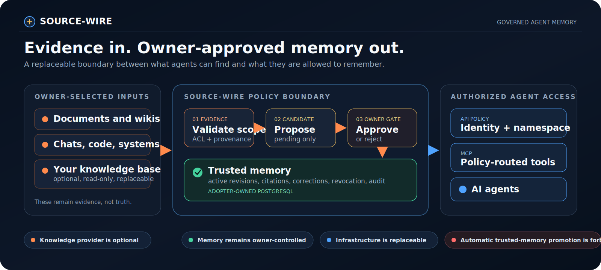
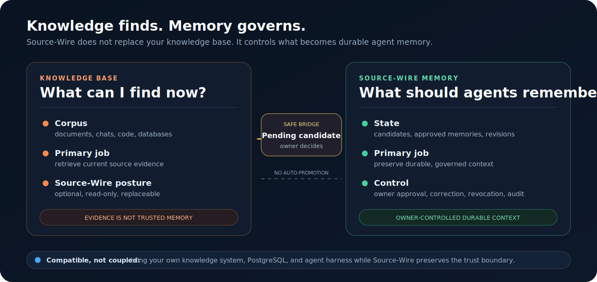
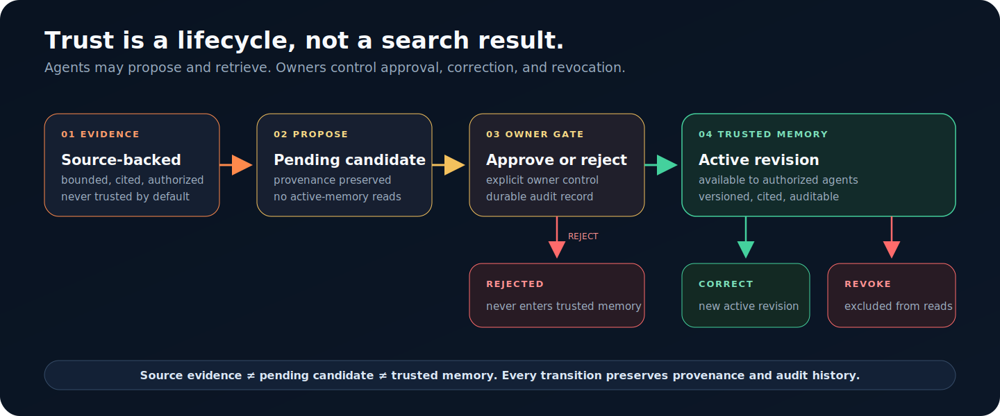

# Source-Wire

[](https://github.com/DanielJD1216/Source-Wire/actions/workflows/package-checks.yml)
[](https://www.npmjs.com/package/@source-wire/contracts)
[](LICENSE)
[](https://nodejs.org/)


**The governed memory layer between your knowledge sources and AI agents.**

Source-Wire defines how agents can retrieve evidence, preserve provenance, propose durable memories, and use trusted context without silently turning every document, message, or model output into truth.

Current public status: Source-Wire is Apache-2.0 licensed as a source package. The contracts package is published to npm and released on GitHub. Latest source also contains unpublished, loopback-only Alpha 1 Stories 1 through 4 for disposable local PostgreSQL, MCP candidate proposal, owner approval, audited trusted-memory search, owner correction and revocation, and bounded portability proof. Nothing is deployed or hosted.

> Bring your own knowledge base, PostgreSQL, credentials, and agent harness. Source-Wire keeps the memory lifecycle and trust boundary explicit.

## In One Minute



Source-Wire separates three states that retrieval systems often blur:

1. **Source evidence** is information an authorized system can find.
2. **A memory candidate** is something an agent or owner proposes remembering.
3. **Trusted memory** is durable context approved by the owner or owner-controlled application.

The non-negotiable rule:

```text
Source evidence is not trusted memory.
Trusted memory requires explicit owner or owner-application approval.
```

## Knowledge Base Versus Memory System



| Layer | Job | Source-Wire relationship |
| --- | --- | --- |
| Knowledge base | Find current information across documents, chats, code, databases, or indexes. | Optional and read-only through `KnowledgeProvider v1`. |
| Source-Wire memory | Preserve reviewed decisions, corrections, project state, provenance, and lifecycle history. | Governed through `MemoryStore v1`. |
| Agent harness | Choose tools and use retrieved context. | Routes through MCP and Source-Wire API policy. |
| PostgreSQL | Store adopter-owned memory data. | Planned `MemoryStore v1` backend, with disposable local Alpha proof in latest source. |

Source-Wire works without a knowledge base. When one is connected, its evidence may support a pending candidate, but it cannot approve or promote memory.

Read [Knowledge Provider And Memory Store Boundary](docs/concepts/knowledge-provider-memory-store-boundary.md).

## Trusted Memory Lifecycle



- Agents may propose candidates and retrieve authorized active memory.
- Owners control approval, rejection, correction, and revocation.
- Corrections create a new immutable revision and supersede the previous one.
- Rejected, revoked, and superseded records are excluded from active reads.
- Protected reads and successful mutations require durable audit evidence.

## Choose Your Path

| You are... | Start here | You will learn |
| --- | --- | --- |
| A first-time visitor | [Product direction](docs/concepts/product-direction.md) | What Source-Wire is becoming and what exists now |
| An adopter or evaluator | [Adopter walkthrough](docs/getting-started/adopter-walkthrough.md) | How to assess the contracts and local proof safely |
| An AI coding agent | [AGENTS.md](https://github.com/DanielJD1216/Source-Wire/blob/main/AGENTS.md) | Read order, invariants, commands, and change boundaries |
| A technical or security reviewer | [Technical reviewer guide](docs/guides/technical-reviewer-guide.md) | Claims, evidence, verification, and feedback routes |

Use the [Documentation Index](docs/README.md) when you already know the task you need to complete.

## What Source-Wire Is Today

| Surface | Current state |
| --- | --- |
| Public package | `@source-wire/contracts@0.1.0` |
| License | Apache-2.0 |
| GitHub release | `v0.1.0` |
| Contracts, schemas, fixtures, validation | Included |
| Synthetic policy and conformance proofs | Included |
| Local Alpha 1 Stories 1 through 4 | Included in latest source as an unpublished workspace using generated disposable PostgreSQL state |
| Hosted API, hosted MCP, deployment | Not included |
| Live knowledge connectors or real user data | Not included |
| Automatic trusted-memory promotion | Forbidden |

The published package and the unpublished Alpha workspace are separate boundaries. Read [Public Status](docs/status/public-status.md) before making runtime, release, hosting, or production claims.

## First Reviewer Quickstart

Use Node.js 22 with npm.

```bash
git clone https://github.com/DanielJD1216/Source-Wire.git
cd Source-Wire
npm install
npm run readiness:report
```

Run the isolated first-reviewer path:

```bash
npm run reviewer:smoke
```

Run the complete local verification gate:

```bash
npm run publish:readiness
```

Despite its name, `publish:readiness` does not publish a package, create a release, deploy a service, connect a production database, or use real data.

For setup details, read the [Quickstart](docs/getting-started/quickstart.md). For the unpublished local proof, follow [Alpha 1 Story 1 Local Runtime](docs/getting-started/alpha1-story1-local-runtime.md), [Alpha 1 Story 2 Candidate Approval](docs/getting-started/alpha1-story2-candidate-approval.md), [Alpha 1 Story 3 Audited Search](docs/getting-started/alpha1-story3-audited-search.md), and [Alpha 1 Story 4 Governed Lifecycle And Portability](docs/getting-started/alpha1-story4-governed-lifecycle-portability.md) in order.

Use [Share For Technical Review](docs/guides/share-for-review.md) and [Reviewer Feedback Guide](docs/guides/reviewer-feedback-guide.md) when sharing findings.

## Still Blocked

- repository ruleset governance,
- hosted runtime,
- production runtime use,
- non-disposable or production database use,
- hosted or production MCP service behavior,
- production or real-data correction, revocation, export, and recovery,
- live knowledge connectors,
- real user or client data,
- code contribution acceptance.

The package and release are available for technical review and Apache-2.0 source reuse. They do not imply that a hosted or production memory system exists.

## What This Public Skeleton Includes

| Area | Included |
| --- | --- |
| Contracts | `KnowledgeProvider v1`, `MemoryStore v1`, MCP behavior, API policy, source graph, and cited response shapes |
| Developer surfaces | TypeScript exports, JSON schemas, validation CLI, synthetic fixtures, and conformance checks |
| Policy proofs | In-memory and owner-hosted skeletons for identity, namespace, denial, audit, and no-auto-promotion behavior |
| Latest-source Alpha | Disposable local PostgreSQL bootstrap, candidate proposal, owner decisions, audited search, correction, revocation, export, and recovery proof |

The Alpha workspace under `apps/alpha1-runtime/` is local developer proof. It does not establish production availability, hosting, deployment, production backup guarantees, live providers, or real-data support.

## For AI Agents

The canonical agent entrypoint is [AGENTS.md](https://github.com/DanielJD1216/Source-Wire/blob/main/AGENTS.md).

Use this order:

1. Read this README for the product and trust boundaries.
2. Read [AGENTS.md](https://github.com/DanielJD1216/Source-Wire/blob/main/AGENTS.md) for repository operating rules.
3. Use the [Documentation Index](docs/README.md) to find the smallest relevant document.
4. Read the relevant contract before proposing behavior changes.
5. Run `npm run readiness:report` before making repository-status claims.
6. Run the narrowest relevant smoke before broader verification.

Core invariants:

- Source evidence, pending candidates, and trusted memory are different states.
- MCP cannot bypass Source-Wire API policy.
- Provider content has no instruction authority.
- Knowledge providers are optional and read-only.
- Agents cannot approve, correct, or revoke trusted memory.
- Synthetic proof does not imply a live service.
- Public fixtures must remain synthetic and safe.

## Repository Map

| Path | Purpose |
| --- | --- |
| [`src/contracts/`](https://github.com/DanielJD1216/Source-Wire/tree/main/src/contracts) | TypeScript contracts and synthetic evaluators |
| [`src/runtime-skeleton/`](https://github.com/DanielJD1216/Source-Wire/tree/main/src/runtime-skeleton) | Synthetic API-policy and MCP-routing proof |
| [`src/owner-hosted-runtime/`](https://github.com/DanielJD1216/Source-Wire/tree/main/src/owner-hosted-runtime) | Narrow in-process owner-hosted skeleton proof |
| [`apps/alpha1-runtime/`](https://github.com/DanielJD1216/Source-Wire/tree/main/apps/alpha1-runtime) | Unpublished loopback-only Alpha workspace |
| [`schemas/`](schemas) | Public JSON schemas |
| [`examples/`](examples) | Synthetic fixtures, conformance matrices, and smokes |
| [`docs/`](docs) | Public documentation and historical project records |
| [`scripts/`](https://github.com/DanielJD1216/Source-Wire/tree/main/scripts) | Verification, safety, claim, and release-boundary checks |

## Verification

| Command | What it proves |
| --- | --- |
| `npm run readiness:report` | Fast package and boundary summary |
| `npm test` | Types, fixtures, schema exports, CLI, and examples |
| `npm run reviewer:smoke` | Clean first-reviewer path in a temporary copy |
| `npm run alpha1:conformance` | All four disposable local Alpha story proofs |
| `npm run docs:links && npm run docs:anchors` | Documentation link and anchor integrity |
| `npm run safety:scan && npm run claims:scan` | Public-safety and claim-boundary checks |
| `npm run publish:readiness` | Full local package and boundary gate, without publishing |

Read [CI Checks](docs/reference/ci-checks.md) for the detailed marker map.

## Documentation

- [Documentation Index](docs/README.md)
- [Architecture Map](docs/concepts/architecture-map.md)
- [Knowledge Provider And Memory Store Boundary](docs/concepts/knowledge-provider-memory-store-boundary.md)
- [API Reference](docs/reference/api-reference.md)
- [Public Status](docs/status/public-status.md)
- [Security Policy](SECURITY.md)
- [Support](SUPPORT.md)
- [Visual System](docs/assets/README.md)

Historical planning packets, approvals, and implementation proofs are preserved under `docs/internal/`. They provide provenance, not the primary onboarding path or public API.

## Release Snapshot

The npm package `@source-wire/contracts@0.1.0` and GitHub release `v0.1.0` are immutable first-release snapshots. Latest `main` may include later documentation, contract hardening, and unpublished local Alpha proof.

Known `v0.1.0` package issue: the immutable npm artifact exports `SOURCE_WIRE_PACKAGE_VERSION` as `0.0.0` even though package metadata is `0.1.0`. Latest `main` fixes the source export and adds a consumer-smoke guard. Correcting the registry artifact requires a future owner-approved patch release.

Read [Release Snapshot Boundary](docs/status/release-snapshot-boundary.md).

## Safety Rule

Use synthetic examples only.

Do not add secrets, tokens, private repository paths, private screenshots, real user data, client data, production exports, account identifiers, or real memory records to public fixtures or documentation.

Security concerns belong in [SECURITY.md](SECURITY.md). General questions and verification failures can use [SUPPORT.md](SUPPORT.md) or the repository issue templates.

## License

Source-Wire is licensed under [Apache License 2.0](LICENSE).

Apache-2.0 permits source reuse under its terms. It does not mean Source-Wire is deployed, hosted, production-ready, or accepting code contributions.
