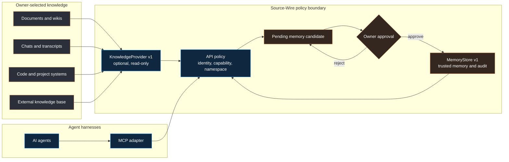
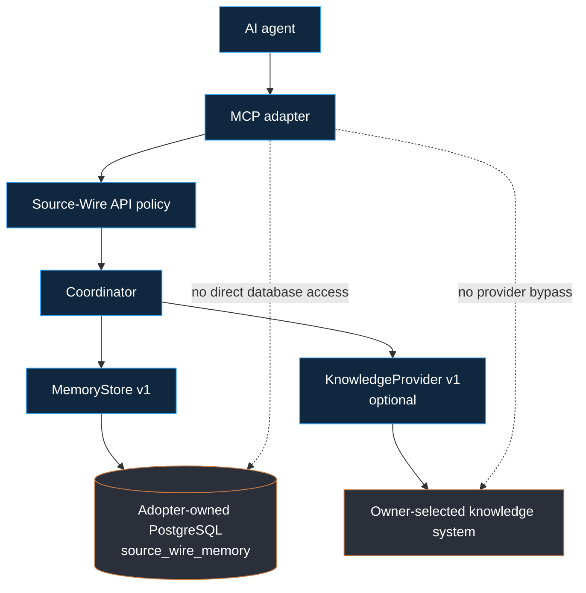
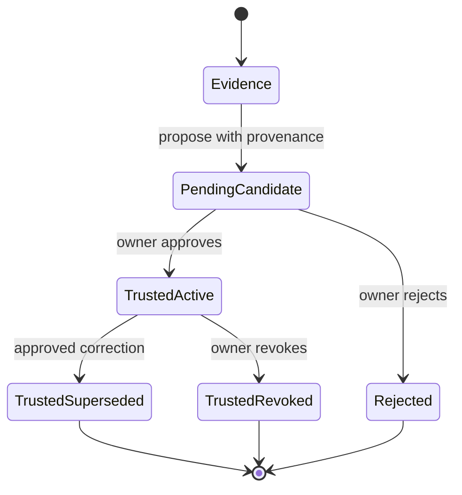

# Source-Wire

[](https://github.com/DanielJD1216/Source-Wire/actions/workflows/package-checks.yml)
[](https://www.npmjs.com/package/@source-wire/contracts)
[](LICENSE)
[](https://nodejs.org/)


**Contracts and safety boundaries for agent-first memory systems.**

Source-Wire defines how AI agents can retrieve source evidence, preserve provenance, propose durable memories, and use trusted context without silently turning every document, message, or model output into truth.

Current public status: Source-Wire is Apache-2.0 licensed as a source package. The contracts package is published to npm and released on GitHub. Latest source also contains unpublished, loopback-only Alpha 1 Stories 1 through 3 for disposable local PostgreSQL, MCP candidate proposal, owner approval, and audited trusted-memory search proof. Nothing is deployed or hosted.

> Source-Wire is the governed memory layer. Your knowledge base, data sources, PostgreSQL infrastructure, and agent harnesses remain replaceable components around it.

## Why Source-Wire Exists

Most retrieval systems answer, “What information can I find?”

An agent memory system must answer harder questions:

- Where did this claim come from?
- Is the caller allowed to see it?
- Is it merely source evidence, or has the owner approved it as trusted memory?
- What changed, what was corrected, and what was revoked?
- Can another agent retrieve the same context with the same policy and audit trail?

Source-Wire makes those distinctions explicit through contracts, schemas, synthetic fixtures, and conformance checks.

## The Mental Model



The central rule is simple:

```text
Source evidence is not trusted memory.
Trusted memory requires explicit owner or owner-application approval.
```

## Memory System Versus Knowledge Base

| Layer | Its job | Source-Wire posture |
| --- | --- | --- |
| Knowledge base | Finds current information across documents, chats, code, databases, or search indexes. | Optional, external, read-only through `KnowledgeProvider v1`. |
| Memory system | Preserves reviewed context, decisions, corrections, project state, provenance, and lifecycle history. | Governed through `MemoryStore v1`. |
| Agent harness | Chooses tools and uses retrieved context to answer or act. | Routes through MCP and Source-Wire API policy. |
| PostgreSQL | Stores adopter-owned memory data. | PostgreSQL is the only planned `MemoryStore v1` backend. Latest source includes a narrow disposable Alpha 1 bootstrap, candidate, owner-approval, and full-text trusted-memory search proof; the published contracts package does not include that runtime. |

Source-Wire can operate without a knowledge base. Owner assertions and prior-memory references can create pending candidates. When a knowledge provider is present, its evidence can support a candidate, but it cannot approve or promote memory.

Read the full [Knowledge Provider And Memory Store Boundary](docs/concepts/knowledge-provider-memory-store-boundary.md).

## What Source-Wire Is Today

Source-Wire is a contracts-first TypeScript package with the first narrow local runtime proof in latest source. The runtime remains a developer alpha, separate from the published contracts package.

| Surface | Current state |
| --- | --- |
| Package | `@source-wire/contracts@0.1.0` |
| License | Apache-2.0 |
| GitHub release | `v0.1.0` |
| Contract types and JSON schemas | Included |
| Synthetic fixtures and conformance smokes | Included |
| Minimal in-memory policy proofs | Included |
| Local Story 1 bootstrap and authenticated health | Included in latest source as an unpublished workspace |
| Local Story 2 MCP candidate and owner approval | Included in the same unpublished workspace |
| Local Story 3 audited trusted-memory search | Included in the same unpublished workspace |
| Hosted API or MCP service | Not included |
| Disposable PostgreSQL Alpha 1 proof | Included in latest source |
| Pending candidate and first trusted revision | Included only in the local Story 2 proof |
| Trusted-memory search | Included only in the local Story 3 proof |
| Trusted-memory correction, supersession, or revocation | Not included in the real runtime |
| Live knowledge connectors | Not included |
| Automatic trusted-memory promotion | Forbidden |

For the local runtime proof, read [Alpha 1 Story 1 Local Runtime](docs/getting-started/alpha1-story1-local-runtime.md), [Alpha 1 Story 2 Candidate Approval](docs/getting-started/alpha1-story2-candidate-approval.md), and [Alpha 1 Story 3 Audited Search](docs/getting-started/alpha1-story3-audited-search.md). For the release boundary, read [Public Status](docs/status/public-status.md) and [Product Direction](docs/concepts/product-direction.md).

## First Reviewer Quickstart

Use Node.js 22 with npm.

```bash
git clone https://github.com/DanielJD1216/Source-Wire.git
cd Source-Wire
npm install
npm run readiness:report
```

`readiness:report` prints a fast, read-only summary of the package, exported surfaces, validation schemas, and intentionally blocked runtime scope.

Run the isolated first-reviewer path:

```bash
npm run reviewer:smoke
```

Run the complete local verification gate:

```bash
npm run publish:readiness
```

Despite its name, `publish:readiness` does not publish a package, create a release, deploy a service, connect a database, or use real data.

For setup details, expected output, and individual commands, read the [Quickstart](docs/getting-started/quickstart.md).

Use [Share For Technical Review](docs/guides/share-for-review.md) and [Reviewer Feedback Guide](docs/guides/reviewer-feedback-guide.md) when sharing the repository or reporting findings.

## Still Blocked

- repository ruleset governance,
- hosted runtime,
- production runtime use,
- non-disposable or production database use,
- hosted or production MCP service behavior,
- trusted-memory correction, supersession, and revocation,
- live knowledge connectors,
- real user or client data,
- code contribution acceptance.

The package and release are available for technical review and Apache-2.0 source reuse. They do not imply that a hosted or production memory system exists.

## What This Public Skeleton Includes

### Core contracts

- [KnowledgeProvider v1](docs/contracts/knowledge-provider-v1-contract.md), optional read-only source evidence.
- [MemoryStore v1](docs/contracts/memory-store-v1-contract.md), candidates, trusted memory, provenance, lifecycle, and audit posture.
- [Owner-Hosted API Plus MCP Boundary](docs/contracts/owner-hosted-api-mcp-boundary-contract.md), identity, capability, namespace, denial, and policy routing.
- [MCP Tool Behavior](docs/contracts/mcp-tool-behavior-contract.md), agent-facing tool boundaries.
- [Source Graph Adapter](docs/contracts/source-graph-adapter-contract.md), source-backed graph evidence.
- [`second-brain.v1`](docs/contracts/second-brain-v1-contract.md), cited response shape.

### Proof and developer surfaces

- TypeScript exports and JSON schemas.
- A validation CLI for public synthetic fixtures.
- Synthetic API, MCP, database, provider, memory-store, threat, and deployment-boundary evaluators.
- Minimal in-memory runtime and owner-hosted runtime skeleton proofs.
- Installed-package, consumer, documentation, safety, and claim-boundary checks.
- Architecture, decision, release, security, and reviewer documentation.

Existing examples under `examples/` are synthetic. The unpublished npm workspace under `apps/alpha1-runtime/` is a real local Alpha 1 Stories 1 through 3 proof against generated disposable PostgreSQL state. It proves a two-tool stdio MCP surface, pending-only proposals, owner-controlled approval or rejection, and audited full-text search over active trusted memory. It does not prove production availability, hosting, deployment, correction, revocation, or real-data support.

## For AI Agents

If you are an AI agent entering this repository, use this order:

1. Read this README for the product and trust boundaries.
2. Read the [Documentation Index](docs/README.md) for task-specific routing.
3. Read the relevant contract before proposing code.
4. Inspect its synthetic fixture matrix and smoke test.
5. Run `npm run readiness:report` before making status claims.
6. Run the narrowest relevant smoke, then the full local gate when warranted.

### Agent operating rules

- Treat source evidence, memory candidates, and trusted memory as different states.
- Preserve owner, namespace, ACL, provenance, citation, version, freshness, and sensitivity fields.
- Never let MCP bypass Source-Wire API policy.
- Never infer a live service from a synthetic smoke test.
- Never auto-promote provider evidence or model output into trusted memory.
- Use synthetic public-safe data only.
- Report gaps and denied results explicitly.

### Fast contract checks

```bash
npm run runtime:knowledge-provider-smoke
npm run runtime:memory-store-smoke
npm run runtime:mcp-adapter-smoke
npm run runtime:api-policy-smoke
```

For public imports and examples, read the [API Reference](docs/reference/api-reference.md) and [TypeScript Examples](examples/typescript/README.md).

## Architecture



Key boundaries:

- MCP routes through API policy.
- Knowledge providers are optional and read-only.
- Memory remains valid without an external provider.
- The adopter owns infrastructure, credentials, deployed data, backups, and migration execution.
- Source-Wire owns its logical schema contract and memory lifecycle invariants.
- Provider or source content has no instruction authority.

Read [Architecture Map](docs/concepts/architecture-map.md) and [ADR 0001](docs/adr/0001-memory-store-and-knowledge-provider-boundary.md).

## Trusted Memory Lifecycle



Important invariants:

- Evidence cannot become trusted memory directly.
- An agent harness cannot approve or revoke trusted memory.
- Corrections create a new immutable revision and supersede the prior revision.
- Revoked and superseded memories are excluded from active reads.
- Protected reads and successful mutations require durable audit receipts.

## Repository Map

| Path | Purpose |
| --- | --- |
| [`src/contracts/`](https://github.com/DanielJD1216/Source-Wire/tree/main/src/contracts) | TypeScript contracts and synthetic evaluators. |
| [`src/runtime-skeleton/`](https://github.com/DanielJD1216/Source-Wire/tree/main/src/runtime-skeleton) | Synthetic API-policy and MCP-routing proof. |
| [`src/owner-hosted-runtime/`](https://github.com/DanielJD1216/Source-Wire/tree/main/src/owner-hosted-runtime) | Narrow in-process owner-hosted runtime skeleton proof. |
| [`apps/alpha1-runtime/`](https://github.com/DanielJD1216/Source-Wire/tree/main/apps/alpha1-runtime) | Unpublished loopback-only Alpha 1 Stories 1 through 3 runtime with disposable PostgreSQL and stdio MCP conformance. |
| [`schemas/`](schemas) | Public JSON schemas. |
| [`examples/`](examples) | Synthetic fixtures, conformance matrices, and smoke tests. |
| [`docs/`](docs) | Architecture, contract, reviewer, release, and safety documentation. |
| [`scripts/`](https://github.com/DanielJD1216/Source-Wire/tree/main/scripts) | Verification, readiness, claim, and release-boundary checks. |

## Package Boundary

The package exports contract types, schema metadata, validation helpers, boundary constants, and synthetic evaluators.

```ts
import {
  SOURCE_WIRE_RUNTIME_BOUNDARY,
  SOURCE_WIRE_KNOWLEDGE_PROVIDER_CONTRACT_VERSION,
  SOURCE_WIRE_MEMORY_STORE_CONTRACT_VERSION
} from "@source-wire/contracts";

console.log(SOURCE_WIRE_RUNTIME_BOUNDARY.runtimeIncluded); // false
console.log(SOURCE_WIRE_KNOWLEDGE_PROVIDER_CONTRACT_VERSION);
console.log(SOURCE_WIRE_MEMORY_STORE_CONTRACT_VERSION);
```

It does not export a hosted backend, production API server, production MCP server, database client, connector engine, memory engine, or Mission Control UI.

## Verification

| Command | What it proves |
| --- | --- |
| `npm run readiness:report` | Fast package and boundary summary. |
| `npm run reviewer:smoke` | Clean first-reviewer setup path in a temporary copy. |
| `npm test` | Type checking, fixture validation, schema exports, CLI, and TypeScript examples. |
| `npm run runtime:knowledge-provider-smoke` | Synthetic read-only provider contract conformance. |
| `npm run runtime:memory-store-smoke` | Synthetic PostgreSQL memory posture and lifecycle conformance. |
| `npm run alpha1:build` | Builds the unpublished local Alpha 1 runtime workspace. |
| `npm run alpha1:test` | Runs focused Alpha 1 unit and MCP discovery tests. |
| `npm run alpha1:conformance:story1` | Uses generated disposable PostgreSQL state to prove bootstrap, credentials, authenticated health, denial paths, and cleanup. |
| `npm run alpha1:conformance:story2` | Uses a real MCP client and generated disposable PostgreSQL state to prove pending proposals, owner decisions, durable idempotency, atomic audit, least privilege, and cleanup. |
| `npm run alpha1:conformance:story3` | Uses real processes and disposable PostgreSQL to prove active-only full-text search, exact audit-before-release receipts, foreign-process and replay denial, crash and outage behavior, bounds, leak resistance, least privilege, and cleanup. |
| `npm run safety:scan` | Public-safety scan for sensitive material. |
| `npm run claims:scan` | Guard against unsupported public runtime claims. |
| `npm run docs:links` | Local documentation link validation. |
| `npm run docs:anchors` | Documentation anchor validation. |
| `npm run publish:readiness` | Full local package, contract, docs, safety, and release-boundary gate. |

Read [CI Checks](docs/reference/ci-checks.md) for the hosted workflow marker map.

## Documentation

### Start here

- [Documentation Index](docs/README.md)
- [Quickstart](docs/getting-started/quickstart.md)
- [Alpha 1 Story 1 Local Runtime](docs/getting-started/alpha1-story1-local-runtime.md)
- [Alpha 1 Story 2 Candidate Approval](docs/getting-started/alpha1-story2-candidate-approval.md)
- [Alpha 1 Story 3 Audited Search](docs/getting-started/alpha1-story3-audited-search.md)
- [Public Status](docs/status/public-status.md)
- [Product Direction](docs/concepts/product-direction.md)
- [Architecture Map](docs/concepts/architecture-map.md)
- [API Reference](docs/reference/api-reference.md)

### Memory and knowledge

- [Knowledge Provider And Memory Store Boundary](docs/concepts/knowledge-provider-memory-store-boundary.md)
- [KnowledgeProvider v1 Contract](docs/contracts/knowledge-provider-v1-contract.md)
- [MemoryStore v1 Contract](docs/contracts/memory-store-v1-contract.md)
- [KnowledgeProvider Smoke](docs/reference/knowledge-provider-smoke.md)
- [MemoryStore Smoke](docs/reference/memory-store-smoke.md)
- [ADR 0001: Memory Store And Knowledge Provider Boundary](docs/adr/0001-memory-store-and-knowledge-provider-boundary.md)

### Review and project boundaries

- [Share For Technical Review](docs/guides/share-for-review.md)
- [Technical Reviewer Guide](docs/guides/technical-reviewer-guide.md)
- [Reviewer Feedback Guide](docs/guides/reviewer-feedback-guide.md)
- [Security Policy](SECURITY.md)
- [Support](SUPPORT.md)
- [Repository Metadata](docs/reference/repository-metadata.md)

## Release Snapshot

The npm package `@source-wire/contracts@0.1.0` and GitHub release `v0.1.0` are immutable first-release snapshots. Latest `main` may include later documentation and contract hardening.

Known `v0.1.0` package issue: the immutable npm artifact exports `SOURCE_WIRE_PACKAGE_VERSION` as `0.0.0` even though package metadata is `0.1.0`. Latest `main` fixes the source export and adds a consumer-smoke guard. Correcting the registry artifact requires a future owner-approved patch release.

Read [Release Snapshot Boundary](docs/status/release-snapshot-boundary.md).

## Safety Rule

Use synthetic examples only.

Do not add secrets, tokens, private repository paths, private screenshots, real user data, client data, production exports, account identifiers, or real memory records to public fixtures or documentation.

Security concerns belong in the process described by [SECURITY.md](SECURITY.md). General questions and verification failures can use [SUPPORT.md](SUPPORT.md) or the repository issue templates.

## License

Source-Wire is licensed under [Apache License 2.0](LICENSE).

Apache-2.0 permits source reuse under its terms. It does not mean Source-Wire is deployed, hosted, production-ready, or accepting code contributions.
